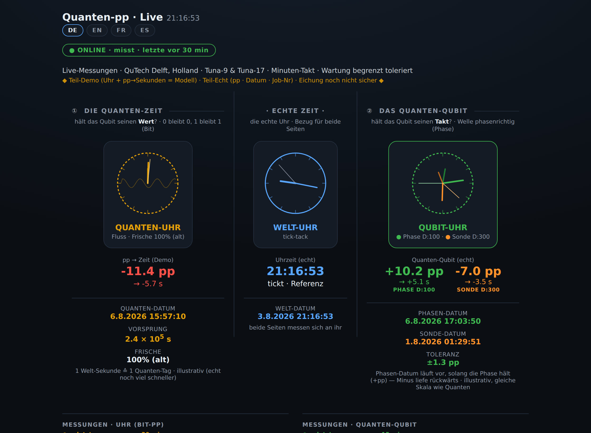

# 🕐 A little quantum clock

**→ Watch it live: https://ingo6.github.io/quanten-uhr/**

Hi, I'm Ingo. I'm self-taught, I build things with my hands, and I came to quantum computing my own way — not through a university. One day I got free access to a *real* quantum chip, and I wanted to actually **watch** it work instead of just reading about it. So I built this clock.

Everything you see comes from a real superconducting chip — **Tuna-9** at **QuTech Delft** in the Netherlands — measured every few minutes, for free, no tricks.

## What you're looking at

Three clocks in a row:

- **middle** — the normal world clock (real time). The reference for both sides.
- **left** — does the qubit keep its **value**? (0 stays 0, 1 stays 1)
- **right** — does the qubit keep its **timing** — its phase, the wave staying in rhythm?

The small `pp` numbers are the real measurements: how much a little protection trick helps the qubit — or hurts it — each with its date and the job number it came from.

## What it actually shows

- A **shallow** phase-protection probe **helps** — every single run (about **+12**).
- A **deep, entangled error-correction code hurts** — it costs more than it saves (about **−11**).
- Keeping the plain *value* sits near the break-even line.

So somewhere between shallow and deep, protection flips from *helping* to *hurting*. Finding where that flip sits — that's the interesting part.

I'm not claiming a discovery. The field already knows this. But I measured it myself, on real hardware, and you can sit here and watch it happen.

## I'd rather be honest than look clever

- **Part-demo, part-real.** The flowing clock hands are an illustration (marked *"Demo · calibration not certain"* on the page). The **numbers, dates, and job IDs are real.** I label which is which, right there.
- When something's uncertain, I write **"?"** instead of pretending I know.
- It's **for everyone**: four languages (DE / EN / FR / ES), works with a screen reader and a keyboard. Free. No account, no tracking, nothing collected. I made it as a gift, not an advert.

## Under the hood

Real chip access through [Quantum Inspire](https://www.quantum-inspire.com/) (QuTech). A small Python program does the measuring; a plain web page draws the clocks in your browser and updates itself. It's a polite neighbour on the shared chip — when another researcher is using it, mine simply **waits.** That waiting is the proof it isn't in anyone's way.

---

*Made by a curious human, honestly. If you build things too — I see you. ⭐*
